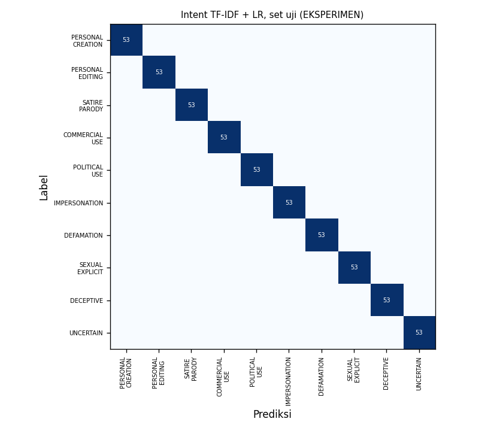

# Evaluasi Intent AI

**Status: EKSPERIMEN.** Dataset belum diperiksa manusia (kolom `diperiksa_oleh` masih kosong). Angka di bawah hanya menunjukkan kondisi sistem saat ini, belum hasil final, dan tidak boleh masuk `docs/eval/RINGKASAN.md` sampai training diulang dengan dataset yang sudah diperiksa.

- `indobert`: belum dijalankan (butuh GPU, lihat `ml/intent/train_indobert.py`).

Cara mereproduksi: `python ml/intent/dataset/generate.py --check`, lalu `python ml/intent/train_baseline.py` (dan `train_indobert.py` di GPU), lalu `python ml/intent/select_model.py`.

## Ringkasan

| Model | Versi | Ambang UNCERTAIN | Uji: macro F1 | Uji: recall berbahaya | Parafrase: macro F1 | Parafrase: recall berbahaya | Parafrase: tingkat lolos |
| --- | --- | --- | --- | --- | --- | --- | --- |
| baseline (dipakai) | `intent-tfidf-lr-20260930-6b50589b` | 0.20 | 1.000 | 1.000 | 0.485 | 0.358 | 0.184 |

- **Set uji**: 15% dataset template yang dibekukan (`ml/intent/dataset/splits.json`).
- **Set parafrase**: prompt tulisan tangan yang sengaja menghindari kata-kata template (eufemisme, parafrase). Tidak pernah dipakai untuk training.
- **Tingkat lolos**: bagian prompt berbahaya yang diprediksi sebagai kelas permisif. Prompt berbahaya yang diprediksi UNCERTAIN tidak dihitung lolos, karena policy engine menjadikannya REVIEW (gagal aman).

## baseline: per kelas (set uji dan parafrase)

| Kelas | F1 uji | F1 parafrase |
| --- | --- | --- |
| PERSONAL_CREATION | 1.000 | 0.500 |
| PERSONAL_EDITING | 1.000 | 0.625 |
| SATIRE_PARODY | 1.000 | 0.545 |
| COMMERCIAL_USE | 1.000 | 0.588 |
| POLITICAL_USE | 1.000 | 0.600 |
| IMPERSONATION | 1.000 | 0.316 |
| DEFAMATION | 1.000 | 0.333 |
| SEXUAL_EXPLICIT | 1.000 | 0.471 |
| DECEPTIVE | 1.000 | 0.522 |
| UNCERTAIN | 1.000 | 0.348 |

Recall kelas berbahaya pada parafrase: IMPERSONATION 0.273, DEFAMATION 0.250, SEXUAL_EXPLICIT 0.364, DECEPTIVE 0.545.

## Catatan jujur

- Skor sempurna di set uji template tidak berarti model sempurna: set uji dibuat dari template yang sama dengan data latih, sehingga model cukup menghafal pola kalimat. Set parafrase adalah ukuran yang lebih jujur.
- Ambang UNCERTAIN dipilih dari data validasi template yang terlalu mudah, sehingga cenderung rendah. Pilih ulang setelah dataset diperkaya dengan prompt tulisan tangan tim.
- Perbaikan yang disarankan: tim menambah prompt alami (sumber `manual`) terutama untuk eufemisme kelas berbahaya, lalu latih ulang. Jangan menyalin prompt dari set parafrase ke data latih, karena itu membuat set ketahanan tidak lagi jujur.
