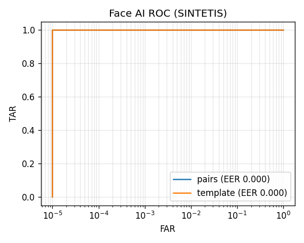

# Evaluasi Face AI (SINTETIS, BUKAN HASIL)

Dijalankan dengan embedding SINTETIS hanya untuk memastikan kode evaluasi berjalan. Angka di bawah TIDAK BOLEH dipakai di proposal atau RINGKASAN.md.

- Tanggal: 2026-09-30
- Relawan: 30, foto: 240
- Cara mereproduksi: `python ml/face_eval/evaluate.py --synthetic`

| Protokol | Pasangan asli | Pasangan asing | TAR @ FAR 1% | Ambang | TAR @ FAR 0,1% | Ambang | EER |
| --- | --- | --- | --- | --- | --- | --- | --- |
| pairs | 840 | 27840 | 1.000 | 0.107 | 1.000 | 0.142 | 0.000 |
| template | 150 | 4350 | 1.000 | 0.110 | 1.000 | 0.146 | 0.000 |

Protokol `pairs`: semua pasangan foto. Protokol `template`: foto probe dibandingkan dengan rata-rata 3 foto enrollment tiap orang, sama seperti gateway.

## Rekomendasi konfigurasi

- `FACE_MATCH_THRESHOLD=0.146`
- `FACE_GRAY_MARGIN=0.02`
- Dasar: threshold at FAR<=0.1% = 0.146; at FAR<=1% = 0.110; margin = max(0.02, gap/2)
- Rekomendasi di atas dari data SINTETIS: jangan dipakai.
