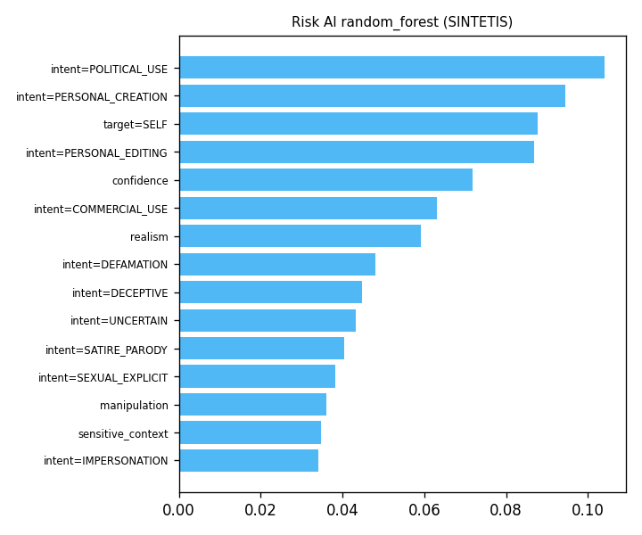

# Evaluasi Risk AI (SINTETIS, BUKAN HASIL)

Label berasal dari dua anotator SINTETIS (aturan + derau), hanya untuk memastikan pipeline berjalan. Angka di bawah TIDAK BOLEH dipakai di proposal atau RINGKASAN.md, dan model ini tidak pernah dimuat backend.

- Tanggal: 2026-09-30
- Skenario berlabel: 517
- Kesepakatan anotator: 86.2%; Cohen's kappa 0.811 (berbobot kuadratik 0.948); 83 tidak sepakat, 0 selesai lewat diskusi
- Cara mereproduksi: `python ml/risk/kappa.py` lalu `python ml/risk/train.py --synthetic`

| Model | Macro F1 (CV) | F1 LOW | F1 MEDIUM | F1 HIGH | F1 CRITICAL |
| --- | --- | --- | --- | --- | --- |
| logistic_regression | 0.838 | 0.922 | 0.808 | 0.662 | 0.962 |
| random_forest (dipilih) | 0.854 | 0.930 | 0.855 | 0.667 | 0.963 |

Validasi silang berstrata 5 lipatan. Model terpilih lalu dilatih ulang dengan semua label.

## Fitur paling berpengaruh (model terpilih)

| Fitur | Bobot |
| --- | --- |
| intent=POLITICAL_USE | 0.104 |
| intent=PERSONAL_CREATION | 0.095 |
| target=SELF | 0.088 |
| intent=PERSONAL_EDITING | 0.087 |
| confidence | 0.072 |
| intent=COMMERCIAL_USE | 0.063 |
| realism | 0.059 |
| intent=DEFAMATION | 0.048 |
| intent=DECEPTIVE | 0.045 |
| intent=UNCERTAIN | 0.043 |

Consent dan izin sengaja bukan fitur (CLAUDE.md bagian 8).
